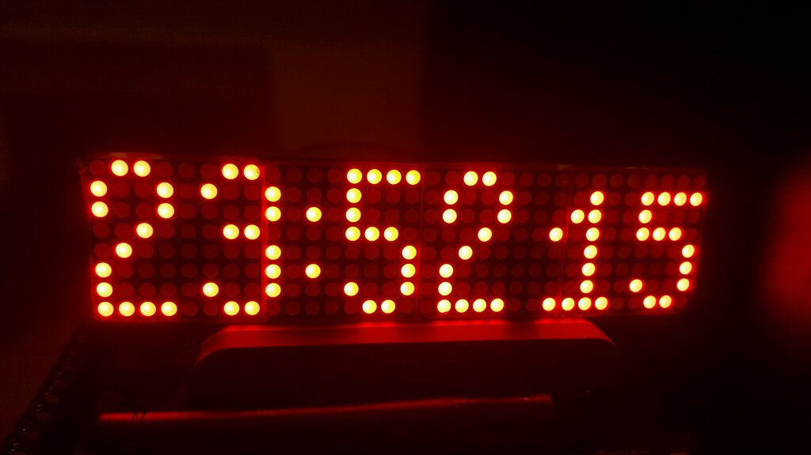
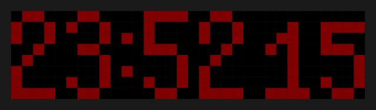
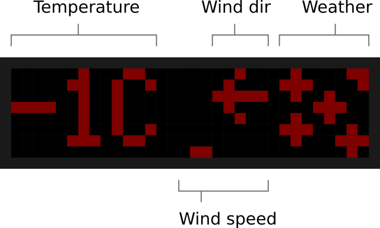

# Dot matrix clock with weather and NTP

This is my dot matrix clock made with ESP8266 WiFi capable MCU. Accurate time signal is acquired from NTP and weather information is available through Openweathermap.org API.

The firmware should be compiled on your own computer using Arduino IDE and then uploaded to the ESP chip. This is not a trivial task but there is a HOWTO section to make it easier with a step-by-step tutorial.

## Features
- 24 hour time display
- NTP sync
- Weather data from Openweathermap.org API
- Outside temperature display
- Wind speed display
- Wind direction display
- Low power, always-on
- DST support (short D5 pin to ground during startup)

## Prerequisites
- ESP8266 board (recommended: Nodemcu/compatible see HOWTO)
- MAX7219 based LED matrix display (order from China)
- Openweathermap account
- Arduino IDE + libraries (see below)

## Time display screen

## Weather display screen
Current weather is displayed 3 times per minute for 4 seconds.

## Installation HOWTO

This HOWTO is by the courtesy of Vajk

### HW BOM:
- [nodemcu v3 board](http://www.banggood.com/Geekcreit-Doit-NodeMcu-Lua-ESP8266-ESP-12E-WIFI-Development-Board-p-985891.html)
- [max7219 based led matrix](https://www.banggood.com/MAX7219-Dot-Matrix-Module-4-in-1-Display-For-Arduino-p-1072083.html)
- micro usb cable
- female-female dupont cable 5pcs (usually comes with the display)

connect display - nodemcu:
- VCC - 3V
- GND - G
- DIN
- CS
- CLK
TODO: find mapping to D6, D7, D8

connect nodemcu board to pc usb, wait till serial driver installs ok. On Windows can use Control panel, Device manager, ports to check COM port number added.

### SW:
- arduino ide: [https://www.arduino.cc/en/main/software](https://www.arduino.cc/en/main/software) 
   - download, install
   - File, Preferences: Additional Boards Manager URLs: [http://arduino.esp8266.com/stable/package_esp8266com_index.json](http://arduino.esp8266.com/stable/package_esp8266com_index.json) 
- esp-matrixclock fw: [https://github.com/adamkovesdi/esp-matrixclock](https://github.com/adamkovesdi/esp-matrixclock) 
   - download as zip, unzip
   - open esp-matrixclock.ino in arduino ide
- NTP client lib: [https://github.com/arduino-libraries/NTPClient/](https://github.com/arduino-libraries/NTPClient/) 
   - download as zip, unzip to program files/Arduino/libraries
- ArduinoJson lib: [https://github.com/bblanchon/ArduinoJson](https://github.com/bblanchon/ArduinoJson) 
   - download as zip, unzip to program files/Arduino/libraries
- Openweathermap: [http://openweathermap.org/](http://openweathermap.org/) 
   - register an account
   - get your api key at: [https://home.openweathermap.org/api_keys](https://home.openweathermap.org/api_keys) 
   - find your location/city id on here: [http://openweathermap.org/help/city_list.txt](http://openweathermap.org/help/city_list.txt) 
- In Arduino ide
   - in file esp-matrixclock.ino (the one that opened by default)
      - uncomment the four lines starting #define MYSSID
      - add your SSID/PSK (wifi access point name, key)
      - add your api key from openweathermap
      - add your city id from same
      - save file
   - Tools, Board: select ESP8266 generic module
   - Tools, Port: select COM port
   - Tools, Reset method: set to nodemcu
   - click upload (right arrow button below menu bar)

